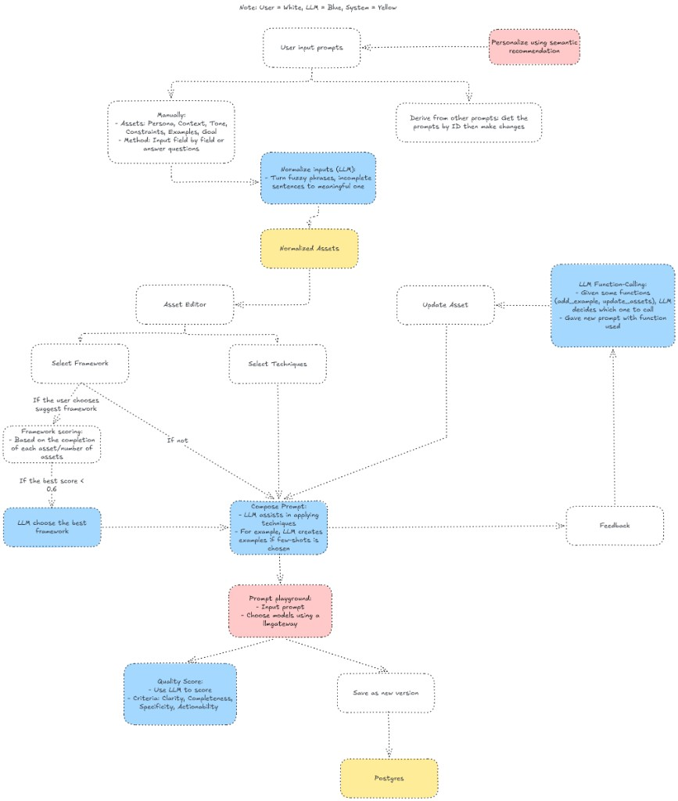

# PromptBank

## Table of contents
- [Overview](#overview)
- [Prompt creation workflow](#prompt-creation-workflow)
- [Feature](#feature)
- [Version diff engine](#version-diff-engine)
- [Structure](#structure)
- [Technologies used](#technologies-used)
- [Installation](#installation)
- [Contact](#contact)
- [Room for improvement](#room-for-improvement)

## Overview
PromptBank is a prompt engineering workspace with:
- A Go backend API for auth, prompt management, versioning, and AI-assisted operations
- A Next.js frontend for composing prompts and managing prompt assets
- Gemini-powered helpers for normalization, framework suggestion, scoring, and iterative refinement

The project focuses on making prompt creation structured, repeatable, and versioned.

## Prompt creation workflow
PromptBank supports both creating a prompt from scratch and deriving a new prompt from an existing one. Users can enter raw prompt ideas, manually edit structured asset fields, ask the LLM to normalize fuzzy input into reusable assets, select frameworks and techniques, compose the final prompt, test it in the playground, and save the result as a new version.



## Feature
- User authentication (register/login) with JWT
- Prompt CRUD and ownership-scoped access control
- Prompt versioning and derive flow
- Prompt composition from:
  - Asset fields (`goal`, `persona`, `context`, `tone`, `constraints`, `examples`)
  - Selected framework
  - Selected techniques
- LLM capabilities:
  - Wizard answer normalization
  - Framework suggestion
  - Prompt quality scoring
  - Iterative refinement with tool-calling
  - Technique-specific AI suggestions (few-shot examples, role persona, constraints)
- Frontend pages for signup/login, prompt list, prompt detail/composition, version browsing

## Version diff engine
PromptBank includes a structured diff engine for prompt versions in `internal/diff/jsonpatch.go`. Instead of comparing composed prompt text, it compares the normalized version document: `assets`, `framework_id`, and `technique_ids`.

The engine emits an RFC 6902-style subset of operations (`add`, `remove`, `replace`) with JSON Pointer paths and summary stats. Ordered arrays such as examples are compared by index, while set-like fields such as technique IDs are compared by membership. The API exposes this through `GET /api/v1/prompts/{promptID}/versions/diff?from=X&to=Y`, and version creation can cache the parent diff in `prompt_versions.diff_from_parent` so later lineage and history features do not need to recompute it.

## Structure
```text
PromptBank/
├─ cmd/
│  ├─ api/                 # API entrypoint
│  └─ worker/              # Worker scaffold (currently placeholder)
├─ internal/
│  ├─ http/                # Router + handlers
│  ├─ llm/                 # Gemini client + normalize/score/refine/suggestion logic
│  ├─ repository/          # Postgres repositories
│  ├─ security/            # JWT and auth helpers
│  ├─ composition/         # Prompt composing pipeline
│  ├─ framework/           # Framework definitions and slot mapping
│  ├─ technique/           # Technique definitions and apply logic
│  └─ asset/               # Asset models and normalization
├─ db/
│  └─ migrations/          # SQL migrations embedded into the API binary
├─ docs/
│  └─ assets/              # README and documentation assets
├─ frontend/               # Next.js app
├─ docker-compose.yml      # Local infra: Postgres + Redis + API
└─ README.md
```

## Technologies used
- Backend: Go (Chi router, pgx, JWT)
- Frontend: Next.js, React, TypeScript
- Database: PostgreSQL
- Cache/queue-ready infra: Redis
- AI integration: Google Gemini (`google/generative-ai-go`)
- Dev environment: Docker Compose

## Installation
### 1) Backend + infrastructure
1. Copy environment file:
   ```bash
   cp .env.example .env
   ```
2. Start services:
   ```bash
   docker compose up --build
   ```
3. Verify API health:
   ```bash
   curl http://localhost:8080/health
   ```

### 2) Frontend
1. Configure frontend env:
   ```bash
   cd frontend
   cp .env.local.example .env.local
   ```
2. Install and run:
   ```bash
   npm install
   npm run dev
   ```
3. Open:
   - [http://localhost:3000](http://localhost:3000)

Notes:
- Default frontend API base is `/backend` (rewrite-based proxy to avoid CORS issues)
- If you change `NEXT_PUBLIC_API_BASE_URL` or `BACKEND_ORIGIN`, restart the frontend server

## Contact
- Open an issue in this repository for bugs, feature requests, or questions.

## Room for improvement
- **Async worker pipeline**  
  `cmd/worker` is currently a scaffold. Move long-running/expensive AI tasks to background jobs (e.g., Redis-backed queue) and let API endpoints return job IDs + status polling/webhooks.

- **Prompt lineage UX and deeper lineage features**  
  Lineage is stored on derive (`prompt_lineage`) but can be expanded with:
  - lineage graph view in frontend
  - branch comparison between versions/prompts
  - clearer ancestry metadata in prompt detail and version cards